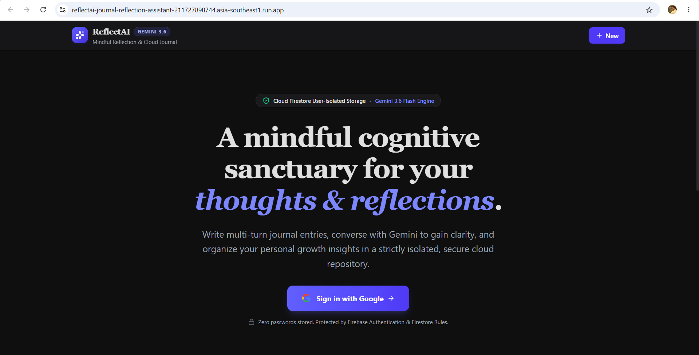

# ReflectAI — Journal & Reflection Assistant

ReflectAI is an AI-powered journaling workspace that combines **Google Sign-In, Cloud Firestore, and Gemini** to help users write, reflect, organize thoughts, and identify recurring patterns across journal entries.

The app supports multi-turn reflection conversations, AI-generated summaries, mood/theme extraction, automatic titles and tags, and a dashboard for reviewing recent reflection patterns.

## Application Preview



## Features

- **Google Sign-In** with Firebase Authentication
- **Private journal storage** using Cloud Firestore
- **User-scoped data access** enforced by Firestore Security Rules
- **Multi-turn AI reflection** powered by Gemini
- Five reflection modes:
  - Deep Reflection
  - Brainstorming
  - Gratitude & Joy
  - Problem Solving
  - Freeform
- AI extraction of:
  - Mood
  - Sentiment score
  - Core themes
- **AI-generated titles and tags**
- **Cognitive summaries** with:
  - Key takeaways
  - Core themes
  - Mood/tone
  - Actionable prompts
- **Weekly pattern analysis** across recent reflections
- Search, favorites, filtering, and journal history
- Markdown export/copy support
- Automatic saving to Firestore
- Responsive dark UI

## How It Works

```text
User
  │
  ├── Google Sign-In
  │       ↓
  │   Firebase Authentication
  │
  ├── Journal Entry
  │       ↓
  │   React Frontend
  │       ↓
  │   Express API
  │       ↓
  │   Gemini
  │       ↓
  │   Reflection + Mood + Themes
  │
  └── Journal Data
          ↓
      Cloud Firestore
          ↓
   User-scoped Security Rules
```

Gemini requests are handled by the server rather than exposing the Gemini API key in the browser.

## Tech Stack

| Layer | Technology |
|---|---|
| Frontend | React + TypeScript |
| Styling | Tailwind CSS |
| Backend | Node.js + Express |
| AI | Google Gemini API |
| Authentication | Firebase Authentication |
| Database | Cloud Firestore |
| Icons | Lucide React |
| Charts | Recharts |
| Build Tool | Vite |
| Deployment | Google Cloud Run |

## Project Structure

```text
ReflectAI-Journal-Reflection-Assistant/
│
├── screenshots/
│   └── welcome_page.png
│
├── src/
│   ├── components/
│   │   ├── InsightsDashboard.tsx
│   │   ├── LandingPage.tsx
│   │   ├── Navbar.tsx
│   │   ├── ReflectionEditor.tsx
│   │   ├── Sidebar.tsx
│   │   └── SummaryCard.tsx
│   │
│   ├── lib/
│   │   ├── firebase.ts
│   │   └── geminiClient.ts
│   │
│   ├── App.tsx
│   ├── index.css
│   ├── main.tsx
│   └── types.ts
│
├── firebase-applet-config.json
├── firestore.rules
├── server.ts
├── package.json
├── vite.config.ts
├── tsconfig.json
└── .env.example
```

## Local Development

### 1. Clone the repository

```bash
git clone https://github.com/YOUR_USERNAME/YOUR_REPOSITORY.git
cd ReflectAI-Journal-Reflection-Assistant
```

### 2. Install dependencies

```bash
npm install
```

### 3. Configure environment variables

Create a `.env` file:

```env
GEMINI_API_KEY=your_gemini_api_key
```

The Gemini key is read by the Express backend through `process.env.GEMINI_API_KEY`.

Do **not** commit `.env` to GitHub.

### 4. Configure Firebase

Create/configure a Firebase project with:

- Firebase Authentication
- Google Sign-In provider
- Cloud Firestore

Add the required Firebase web configuration to the project.

Deploy the included Firestore rules:

```bash
firebase deploy --only firestore:rules
```

### 5. Start the development server

```bash
npm run dev
```

The application will run on the configured local server.

## Production Build

```bash
npm run build
npm start
```

## Deployment

ReflectAI can be deployed as a Node.js application on **Google Cloud Run**.

For production:

1. Store `GEMINI_API_KEY` in a secret manager.
2. Inject the secret into the Cloud Run service as an environment variable.
3. Build the application.
4. Deploy the service to Cloud Run.
5. Configure Firebase Authentication with the deployed domain.
6. Verify the Firestore rules before using the application with real user data.

## Security Design

ReflectAI uses several layers of protection:

### Authentication

Users authenticate through Firebase Authentication using Google Sign-In.

### Firestore isolation

Journal entries are stored under a user-specific path:

```text
/users/{userId}/entries/{entryId}
```

The Firestore rules require the authenticated user's UID to match the `{userId}` in the document path.

### Server-side Gemini API key

The Gemini API key is accessed only by the Express backend:

```ts
const apiKey = process.env.GEMINI_API_KEY;
```

The frontend communicates with backend endpoints such as:

```text
/api/gemini/reflect
/api/gemini/summarize
/api/gemini/suggest-meta
/api/gemini/pattern-summary
```

This prevents the Gemini secret from being placed directly in frontend JavaScript.

## Important Firebase Configuration Note

`firebase-applet-config.json` contains Firebase web-app configuration, including a Firebase/Google API key.

Firebase web API keys are generally identifiers rather than passwords or service-account credentials, so their presence in a browser application is normal. However, the key should still be **properly restricted in Google Cloud** and should not be treated as a secret substitute.

Never place any of the following in the repository:

- Gemini API keys
- Service-account JSON files
- Private keys
- Passwords
- Database credentials
- OAuth client secrets
- `.env` files containing real secrets

The repository's `.gitignore` excludes `.env` files.

## Firestore Data Model

```text
users/
└── {userId}/
    ├── entries/
    │   └── {entryId}
    │
    └── interactions/
        └── {interactionId}
```

Each user's journal data is accessed using their authenticated Firebase UID.

## AI Capabilities

### Reflection

Gemini receives the current journal prompt and relevant conversation history and returns:

- Reflection response
- Mood
- Sentiment score
- Core themes

### Cognitive Summary

A journal entry and its reflection conversation can be converted into a structured summary containing:

- Executive reflection
- Key takeaways
- Core themes
- Mood/tone
- Actionable prompts

### Pattern Analysis

The Insights dashboard analyzes recent structured mood/theme information to identify recurring themes and changes in sentiment without sending the full historical journal text for the weekly pattern summary.

## Why This Project

ReflectAI was built as a practical example of combining:

- AI application development
- Full-stack TypeScript
- Server-side API integration
- Authentication
- Cloud database design
- Security rules
- Structured AI outputs
- Data visualization
- Cloud deployment

It demonstrates how an AI feature can be integrated into a real application rather than being limited to a standalone chatbot.

## Disclaimer

ReflectAI is a journaling and reflection tool. It is **not a medical, psychological, or emergency service** and should not be used as a replacement for professional care.
